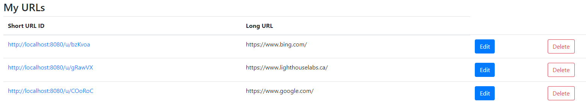
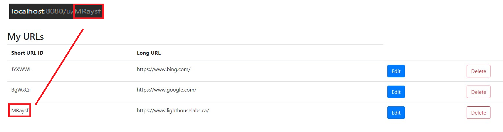

# TinyApp Project

TinyApp is a full stack web application built with Node and Express that allows users to shorten long URLs (à la bit.ly).

## Final Product

We can add a variety of websites and TinyApp will create a random short link for us:

We can use the shortlink by adding /u/ before. For example /u/MRaysf:

After the URL has been submitted, we are redirected to the longURL that has been stored.

## Dependencies

- Node.js
- Express
- EJS
- bcryptjs
- cookie-session

## Getting Started

- Install all dependencies (using the `npm install` command).
- Run the development web server using the `node express_server.js` command.