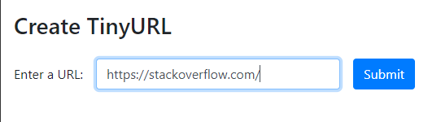
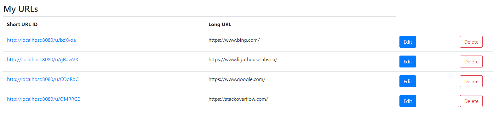

# TinyApp Project

TinyApp is a full stack web application built with Node and Express that allows users to shorten long URLs (à la bit.ly).

## Final Product

We can add a variety of websites and TinyApp will create a random short link for us:

Here is an example of adding https://stackoverflow.com/ to the list of short links:

After the URL has been submitted it has been added with a clickable short link!

## Dependencies

- Node.js
- Express
- EJS
- bcryptjs
- cookie-session

## Getting Started

- Install all dependencies (using the `npm install` command).
- Run the development web server using the `node express_server.js` command.

## Credit

https://attacomsian.com/blog/javascript-generate-random-string was used to offer guidance on the generateRandomUserID function.

ChatGPT was used to generate http tests

Larry Bot was used for clarification and logic guidance for the /url and /url/:id GET methods.